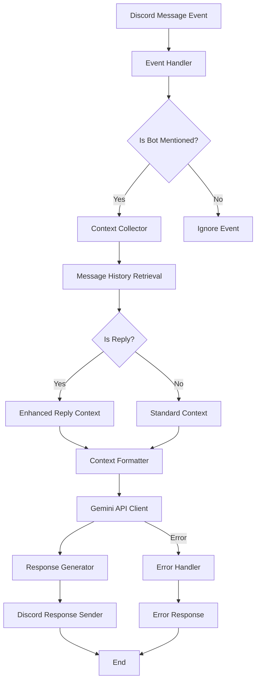

# Discord Grok Bot Design Document

## Overview

The Discord Grok Bot is a Python application that provides AI-powered conversational responses in Discord channels. It leverages Google's Gemini API to generate contextually aware responses when mentioned by users. The bot maintains conversation context by analyzing recent message history and provides enhanced context understanding for reply-based interactions.

## Architecture

The bot follows an event-driven architecture using the discord.py library for Discord integration and the google-generativeai library for Gemini API access.



## Components and Interfaces

### 1. Discord Client (`DiscordBot`)
- **Purpose**: Main bot class that handles Discord connection and events
- **Key Methods**:
  - `on_ready()`: Bot initialization and startup logging
  - `on_message(message)`: Primary message event handler
  - `is_bot_mentioned(message)`: Check if bot is mentioned in message
- **Dependencies**: discord.py library

### 2. Context Manager (`ContextCollector`)
- **Purpose**: Collects and formats conversation context for AI processing
- **Key Methods**:
  - `get_channel_context(channel, limit=100)`: Retrieve recent messages
  - `get_reply_context(message, range=10)`: Get enhanced context for replies
  - `format_context(messages)`: Format messages for Gemini API
- **Data Structures**:
  - `MessageContext`: Contains message content, author, timestamp
  - `ContextWindow`: Aggregated context with metadata

### 3. Gemini Client (`GeminiClient`)
- **Purpose**: Interface with Google's Gemini API for response generation
- **Key Methods**:
  - `generate_response(prompt, context)`: Send request to Gemini API
  - `format_prompt(user_message, context)`: Structure prompt for optimal results
  - `handle_api_errors(error)`: Process and categorize API errors
- **Configuration**:
  - Model: `gemini-1.5-flash` (for speed and cost efficiency)
  - Temperature: 0.7 (balanced creativity and coherence)
  - Max tokens: 1000 (reasonable response length)

### 4. Error Handler (`ErrorManager`)
- **Purpose**: Centralized error handling and user feedback
- **Key Methods**:
  - `handle_api_error(error, context)`: Process Gemini API errors
  - `handle_discord_error(error, context)`: Process Discord API errors
  - `get_user_friendly_message(error_type)`: Generate appropriate user messages
- **Error Categories**:
  - Rate limiting
  - API unavailability
  - Invalid requests
  - Network timeouts

## Data Models

### MessageContext
```python
@dataclass
class MessageContext:
    content: str
    author: str
    timestamp: datetime
    message_id: int
    is_reply: bool = False
    replied_to_id: Optional[int] = None
```

### BotConfig
```python
@dataclass
class BotConfig:
    discord_token: str
    gemini_api_key: str
    max_context_messages: int = 100
    reply_context_range: int = 10
    response_timeout: int = 30
    max_retries: int = 3
```

### APIResponse
```python
@dataclass
class APIResponse:
    success: bool
    content: Optional[str]
    error_type: Optional[str]
    retry_after: Optional[int]
```

## Error Handling

### API Error Categories
1. **Rate Limiting**: Implement exponential backoff with jitter
2. **Authentication Errors**: Log and exit with clear configuration guidance
3. **Content Policy Violations**: Sanitize input and provide user feedback
4. **Network Timeouts**: Retry with increasing delays
5. **Service Unavailability**: Graceful degradation with user notification

### Error Response Strategy
- Never expose internal error details to users
- Provide actionable feedback when possible
- Log all errors with sufficient context for debugging
- Maintain bot availability during individual request failures

## Testing Strategy

### Unit Tests
- Context collection and formatting logic
- Prompt construction and sanitization
- Error handling for various API responses
- Configuration validation

### Integration Tests
- Discord event handling with mock messages
- Gemini API integration with test prompts
- End-to-end message flow simulation
- Error scenario validation

### Performance Tests
- Context retrieval speed with large message histories
- Concurrent request handling
- Memory usage with extended operation
- API response time monitoring

## Security Considerations

### Token Management
- Store all API keys in environment variables
- Validate tokens on startup without logging values
- Implement token rotation capability for production

### Input Sanitization
- Filter out potentially harmful content before API calls
- Implement content length limits
- Validate message structure and encoding

### Rate Limiting Protection
- Implement client-side rate limiting to prevent API abuse
- Track usage patterns and implement cooling-off periods
- Monitor for unusual activity patterns

## Deployment Configuration

### Environment Variables
```
DISCORD_BOT_TOKEN=your_discord_bot_token
GEMINI_API_KEY=your_gemini_api_key
MAX_CONTEXT_MESSAGES=100
REPLY_CONTEXT_RANGE=10
RESPONSE_TIMEOUT=30
LOG_LEVEL=INFO
```

### Dependencies
- `discord.py>=2.3.0`: Discord API integration
- `google-generativeai>=0.3.0`: Gemini API client
- `python-dotenv>=1.0.0`: Environment variable management
- `aiohttp>=3.8.0`: Async HTTP client for API calls

### Logging Configuration
- Structured logging with JSON format for production
- Separate log levels for different components
- Rotation and retention policies for log files
- Performance metrics collection