# Discord AI Bot Codebase Report

Date: 2026-06-17

This report summarizes a full read-only review of the Discord AI bot repository. I used four focused subagents for independent coverage, then verified and synthesized their findings locally.

Subagent coverage:

- Startup, configuration, Discord lifecycle, and command routing.
- Core message processing, Gemini pipeline, media handling, prompts, rendering, and splitting.
- Persistence, reports, settings, preferences, visibility, pins, rate limiting, token tracking, help, and tests.
- Operations, dependencies, logging, errors, security/privacy, scripts, README, and existing diagrams.

Local verification performed after review:

- `python -m pytest -q` passed: 2 tests.
- `python -m compileall -q src tests scripts main.py` passed.

No source behavior was changed by this review.

## Executive Summary

This is a Python `discord.py` bot centered on `src/bot/discord_bot.py`. It responds to DMs, direct mentions, replies to bot messages, role mentions for roles the bot has, and optional per-channel live mode. The bot uses Google Gemini through `google-genai` for text, context selection, multimodal inputs, Google Search grounding, and image generation/editing. Most durable application state is stored in one SQLite database path from `config.token_db_path`, defaulting to `data/token_usage.db`.

The high-level architecture is service-oriented:

- `main.py` loads `.env`, validates `config.yaml`, creates `DiscordBot`, and connects to Discord.
- `DiscordBot` owns the Discord lifecycle, message event handling, live mode, context collection, media extraction, Gemini calls, token tracking, response rendering, and safe sending.
- `commands.py` registers slash commands and creates several persistence services that are attached back to the bot instance.
- `GeminiClient` handles text generation, routing support, context selection, search grounding, safety settings, thinking config, retry handling, and token extraction.
- `ImageProcessingService` and `NanoBananaClient` handle queued image edits and direct text-to-image generation.
- Support services handle reports, local report web UI, user preferences, channel settings, pins, message hide/unhide, token leaderboard, rate limiting, UX helpers, and help content.

Main risks found:

1. Several global configuration/dev commands are not permission-gated, including `/config model`, `/config deepsearch`, `/config debug`, `/config image-generation`, and `/dev`.
2. Per-user preferred model handling mutates the shared `GeminiClient` model state, so one user's preference can affect later or concurrent users.
3. Logs include sensitive material: API key fragments, prompts, context, model outputs, uploaded file previews, and raw exception text.
4. The report web UI has no authentication or CSRF protection. It is safe only while bound to localhost.
5. `/pin` stores "always remember" memories, but `PinService.get_pins_for_prompt()` is not called by the response path, so pins do not currently affect AI responses.
6. Search plus multimodal input silently drops non-text parts in `GeminiClient`, so an online-search request with images/audio may ignore media.
7. `scripts/health_check.py` imports the removed `google.generativeai` SDK even though `requirements.txt` now installs `google-genai`.
8. README/deployment docs reference files not present in the repo and contain stale behavior descriptions.

## Repository Map

| Path | Role |
| --- | --- |
| `main.py` | Process entrypoint. Loads env/config, validates startup connectivity, creates and starts `DiscordBot`. |
| `config.yaml` | Non-secret runtime configuration: bot settings, report web UI, logging, context windows, models, generation parameters, safety thresholds, image settings, rate limits, prompts, validation, misc limits. |
| `requirements.txt` | Python dependencies for Discord, Gemini, config loading, web UI, media/PDF processing, rendering, templates, logging, and health checks. |
| `src/config.py` | `BotConfig` dataclass, YAML/env loading, validation, token checks, logging setup, feature availability, startup connectivity checks. |
| `src/constants.py` | Fixed API limits and supported file/media constants. |
| `src/models/data_models.py` | Shared dataclasses and enums: `MessageContext`, `TokenUsage`, `APIResponse`, `EditType`, image edit request/result, validation result. |
| `src/bot/discord_bot.py` | Main `discord.Client` subclass. Owns service setup, Discord events, live mode, context handling, media extraction, AI calls, output sending, token usage recording. |
| `src/bot/commands.py` | Slash command registration and command handlers. Also creates channel settings, pin, visibility, and user preference services. |
| `src/bot/enhanced_command_handler.py` | Gemini router-based natural language intent/complexity classification and image edit/generation command handling. |
| `src/services/context_collector.py` | Fetches and formats recent channel/reply context as `MessageContext` objects. |
| `src/services/gemini_client.py` | Main Gemini text/multimodal client with context selector, prompt construction, search grounding, thinking config, safety settings, retries, and response parsing. |
| `src/services/nano_banana_client.py` | Gemini image model client for text-to-image and image editing. |
| `src/services/image_processing_service.py` | Queue, worker pool, image validation, image edit rate limiting, progress, job state, and image service health. |
| `src/services/message_splitter.py` | Smart long-message splitting with markdown/code-block preservation. |
| `src/services/content_renderer.py` | Post-processes AI output: LaTeX image rendering, inline math conversion, markdown table formatting. |
| `src/services/report_service.py` | SQLite-backed report tracking. |
| `src/services/report_web_server.py` | Local aiohttp report web UI and report status/admin note mutation. |
| `src/services/channel_settings_service.py` | SQLite-backed per-channel personality and live-mode settings. |
| `src/services/user_preferences_service.py` | SQLite-backed per-user preferred model and language. |
| `src/services/message_visibility_service.py` | Stores original bot message content for `/hide` and `/unhide`. |
| `src/services/pin_service.py` | Stores/list/deletes per-channel pinned memories. Prompt injection helper exists but is unused. |
| `src/services/rate_limiter.py` | In-memory per-user text rate limiter for mention/live message paths. |
| `src/services/token_tracker.py` | SQLite-backed token usage event storage and leaderboard aggregation. |
| `src/services/user_experience_service.py` | Typing indicators, embeds, reaction feedback, progress/completion notifications, cleanup. |
| `src/services/help_system.py` | Static help sections and command suggestions. Appears dormant; no `/help` command is registered. |
| `src/utils/error_manager.py` | Central error categorization, user/technical messages, API/Discord/image/formatting error helpers, error reply fallback. |
| `src/utils/logging_config.py` | Structured logging, performance/image/message formatting loggers, timing context. |
| `src/utils/markdown_utils.py` | Markdown block parsing and safe split point helpers. |
| `src/utils/image_utils.py` | Image validation and supported format helpers. |
| `src/utils/token_extraction.py` | Shared Gemini usage metadata parser. |
| `scripts/health_check.py` | Operational health check for config, filesystem, memory, Gemini chat, and image service. Currently uses stale Gemini SDK import. |
| `scripts/cleanup_pycache.py` | Recursive cleanup tool for `__pycache__` and Python bytecode files. |
| `tests/test_report_service.py` | Unit tests for basic report creation/status update and invalid status rejection. |
| `grok-prompts/*.j2` | Prompt assets. Normal chat uses `config.yaml` prompts, not most files here. `/deepresearch` loads `default_deepsearch_final_summarizer_prompt.j2`. |
| `README.md` | User/operator documentation. Several sections are stale or reference missing artifacts. |
| `pipeline.html`, `message-sequence-flowchart.html` | Existing visual docs. They reflect some newer behavior than README but still do not replace source-of-truth code review. |

## System Flowchart

```mermaid
flowchart TD
  Start["Process start: start.bat/start.sh or python main.py"] --> Env["Load .env"]
  Env --> Config["Load config.yaml and env secrets into BotConfig"]
  Config --> Validate["Validate required tokens, models, prompts, limits"]
  Validate --> Logging["Configure logging"]
  Logging --> BotInit["Create DiscordBot"]

  BotInit --> Services["Initialize services: ErrorManager, TokenTracker, ReportService, ContextCollector, GeminiClient, MessageSplitter, ContentRenderer, UX, rate limiter"]
  Services --> ImageConfigured{"Nano Banana / Gemini image key configured?"}
  ImageConfigured -->|Yes| ImageService["Create ImageProcessingService and EnhancedCommandHandler"]
  ImageConfigured -->|No| NoImage["Image features disabled"]
  ImageService --> Ready
  NoImage --> Ready

  Ready["Discord on_ready"] --> StartOptional["Start image workers and report web UI if enabled"]
  StartOptional --> Presence["Set Discord presence"]
  Presence --> Commands["Register slash commands via setup_commands"]
  Commands --> Sync["Global app command sync"]
  Sync --> Listen["Listen for Discord messages and interactions"]

  Listen --> Msg["on_message"]
  Msg --> IgnoreBots{"Author is bot?"}
  IgnoreBots -->|Yes| Drop["Ignore"]
  IgnoreBots -->|No| LiveCheck{"Guild channel live mode enabled?"}

  LiveCheck -->|Yes| LiveQueue["Enqueue message in per-channel live queue"]
  LiveQueue --> LiveWorker["Live worker batches pending messages"]
  LiveWorker --> LiveRate{"Text rate limit ok?"}
  LiveRate -->|No| RateReply["Reply with rate-limit message"]
  LiveRate -->|Yes| LiveAttach{"Any attachments?"}
  LiveAttach -->|Yes| FullPipeline["Use full context/media pipeline with live overrides"]
  LiveAttach -->|No| LiveGemini["Generate short live response with rolling in-memory context"]
  LiveGemini --> TokenUsage["Record token usage if available"]
  TokenUsage --> SendSafe["Render, split, and send response safely"]

  LiveCheck -->|No| MentionCheck{"DM, direct mention, reply to bot, or bot role mention?"}
  MentionCheck -->|No| Drop
  MentionCheck -->|Yes| TextRate{"Text rate limit ok?"}
  TextRate -->|No| RateReply
  TextRate -->|Yes| Enhanced{"EnhancedCommandHandler available?"}

  Enhanced -->|Yes| Router["Gemini router classifies intent and complexity"]
  Enhanced -->|No| ExtractPrompt["Extract user prompt"]
  Router --> Intent{"Intent"}
  Intent -->|image_generate| ImageGen["Direct Gemini image generation via NanoBananaClient"]
  Intent -->|image_edit| ImageEdit["Queue image edit job via ImageProcessingService"]
  Intent -->|text/unknown| ExtractPrompt

  ImageGen --> ImageResult{"Image result ok?"}
  ImageEdit --> ImageWorkers["Image workers validate, rate-limit, call Gemini image model"]
  ImageWorkers --> ImageResult
  ImageResult -->|Yes| ImageReply["Reply with generated/edited image and token usage"]
  ImageResult -->|No| ErrorReply["Send user-friendly error"]

  ExtractPrompt --> EmptyPrompt{"Prompt or media present?"}
  EmptyPrompt -->|No| AskForPrompt["Ask user to include prompt/media"]
  EmptyPrompt -->|Yes| Collect["Collect channel and reply context"]
  Collect --> SelectContext["Gemini router selects relevant context by complexity limit"]
  SelectContext --> Media["Extract current/replied/context images, PDFs, audio, and text files"]
  Media --> Prefs["Apply channel personality and user language/model preferences"]
  Prefs --> Search{"Search enabled by forced DeepSearch or prompt heuristics?"}
  Search --> GeminiText["Gemini generate_response with prompt, selected context, media parts, safety settings, thinking config"]
  GeminiText --> Finish{"Gemini finish reason"}
  Finish -->|STOP or MAX_TOKENS with text| SuccessText["Add model/search headers, sources, token usage"]
  Finish -->|Safety, recitation, empty, timeout, exception| ErrorReply
  SuccessText --> TokenUsage

  SendSafe --> Renderer["ContentRenderer: LaTeX images, inline math, tables"]
  Renderer --> Long{"Over Discord limit?"}
  Long -->|Yes| Split["MessageSplitter and paginated embed"]
  Long -->|No| Reply["Discord reply"]
  Split --> Sources["Send grounding sources if present"]
  Reply --> Sources

  Listen --> Slash["Slash command interaction"]
  Slash --> CommandGroup["setup_commands callbacks"]
  CommandGroup --> ConfigCmds["Config/stats/dev/API usage/deepresearch/summarize"]
  CommandGroup --> PersistenceCmds["Reports, personality, live mode, pins, hide/unhide, preferences"]
  CommandGroup --> ImageSlash["edit-image and image-queue if image service exists"]
  PersistenceCmds --> SQLite["SQLite token_usage.db tables"]
  TokenUsage --> SQLite
  ConfigCmds --> RuntimeState["Mutable runtime state: model, thinking, search, debug, image_generation_enabled"]
```

## Startup And Runtime Lifecycle

Startup begins in `start.bat`, `start.sh`, or directly through `python main.py`.

1. Startup scripts enter the project root, create or reuse `.venv`, optionally remove/recreate `.venv` with `--rebuild`, install `requirements.txt`, then run `main.py`.
2. `main.py` calls `load_dotenv()`, prints early startup banners, loads and validates config, then calls `validate_startup_connectivity(config)`.
3. `load_and_validate_config()` in `src/config.py` loads `config.yaml`, reads secrets from env, validates required values, validates token lengths, sets up logging, and prints feature availability.
4. `DiscordBot(config)` initializes Discord intents, services, optional image processing, enhanced routing, a command tree, live-mode state, and the per-user text rate limiter.
5. `bot.start(config.discord_token)` connects to Discord.
6. `on_ready()` starts optional image workers, starts the report web UI if enabled, sets bot presence, calls `setup_commands()`, and globally syncs commands.
7. `close()` stops report web UI, image processing workers, and UX typing indicators before closing the Discord client.

Important lifecycle concern: `on_ready()` calls `setup_commands()` every time Discord fires ready. On reconnect/resume patterns, this can attempt to re-add commands and services to the same command tree again. A guard such as `self._commands_registered` would make startup idempotent.

## Configuration Model

Secrets come from `.env` / process environment:

- Required: `DISCORD_BOT_TOKEN`, `GEMINI_API_KEY`.
- Optional: `NANO_BANANA_API_KEY`, defaulting to `GEMINI_API_KEY`; `TOKEN_DB_PATH`; `LOG_FILE`.

Everything else is expected in repo-root `config.yaml`. There is no runtime config-path override in `main.py` or `BotConfig.from_yaml()` beyond calling the classmethod manually.

Key config sections:

- `bot`: dev mode, token DB path.
- `reports`: local report web UI toggle, host, port.
- `logging`: level, file, performance logging.
- `context`: channel/reply context windows and max context images.
- `response`: timeouts and retries.
- `messages`: Discord split lengths and code-block preservation.
- `ux`: typing indicators, rich embeds, reactions, suggestions.
- `models`: default/router/valid models, display names, thinking backend, router cache.
- `model_complexity`: low/medium/high model and thinking-level mapping.
- `generation`: Gemini sampling and max output tokens.
- `safety`: Gemini safety thresholds.
- `image_processing`, `rate_limiting`, `nano_banana`, `languages`, `personalities`, `system_prompts`, `validation`, `misc`.

Configuration risks:

- `NANO_BANANA_API_KEY` defaults to `GEMINI_API_KEY`, so image services appear configured whenever text Gemini is configured.
- `validate_startup_connectivity()` always returns `True`, even if checks fail; startup never blocks on actual external service connectivity.
- The README says Python 3.8+, but code uses newer type syntax that is safer to document as Python 3.10+.

## Message Processing Flow

### Trigger Filtering

`DiscordBot.on_message()` handles normal Discord messages:

1. Ignore messages from bot users.
2. If live mode is enabled for the channel, enqueue the message for channel-specific live processing.
3. Otherwise require one of:
   - private DM,
   - direct bot mention,
   - reply to a bot message,
   - role mention where the bot has that non-default role.
4. Apply in-memory text rate limiting.
5. If enhanced command handling exists, route message through the Gemini router for intent and complexity.
6. If not handled as image generation/editing, extract prompt, collect context, and generate a text response.

### Live Mode

Live mode is a per-channel setting stored in SQLite by `ChannelSettingsService`. When enabled, guild messages in that channel bypass mention requirements.

Live mode behavior:

- Uses a per-channel queue and task to batch pending messages.
- Applies the same text rate limiter to the last message author.
- Keeps rolling in-memory live context with up to `self._live_turn_window * 2` entries.
- Uses `config.router_model_name` as `_live_model_name`.
- Forces short prompt mode and disables search for live responses.
- If attachments are present, falls back into the full `_process_message_with_context()` media path with live-specific overrides.

### Enhanced Router

`EnhancedCommandHandler` is only created when image processing is available. It uses Gemini to classify:

- `image_generate`
- `image_edit`
- `text`

It also classifies complexity:

- `low`
- `medium`
- `high`

Router decisions are cached in an LRU-like in-memory cache keyed by normalized message content plus a boolean for image attachments. On router failure, the fallback is unknown intent and low complexity.

Behavioral implication: if image processing fails or is not configured, the enhanced router is unavailable, so text complexity routing also disappears and normal messages default to low complexity.

## Text AI Pipeline

The normal text path is:

1. `_extract_user_prompt()` removes bot mentions, `@everyone`, and `@here`.
2. `_process_message_with_context()` chooses context size from low/medium/high complexity.
3. `ContextCollector.get_channel_context()` fetches recent channel messages, skips bots, applies the cutoff window, adds attachment/embed/sticker/forwarded metadata as text, and returns chronological `MessageContext` records.
4. If the user message is a reply, `get_reply_context()` fetches the replied-to message plus before/after windows, then de-duplicates against standard channel context.
5. `GeminiClient.select_relevant_context()` asks the router model to return JSON `selected_message_ids`, then finalizes the selected set with anchor messages and a bounded max count.
6. `_generate_and_send_response()` extracts media/files:
   - current and replied images,
   - PDFs rendered to images with PyMuPDF,
   - image attachments from selected context messages,
   - audio/voice files as bytes plus MIME type,
   - non-image text files decoded into prompt text.
7. Channel personality and user preferences are applied.
8. `GeminiClient.generate_response()` formats the prompt with system instructions, selected context, image mapping, language/personality instructions, and user prompt.
9. Gemini receives text plus image/audio `Part`s, optional Google Search tool, safety settings, thinking config, and max output tokens selected by complexity.
10. Response finish reason is parsed. Successful text gets a model header and optional search-grounding header/sources.
11. Token usage is extracted and persisted.
12. `ContentRenderer` post-processes LaTeX and tables.
13. Long content is split through `MessageSplitter` and sent as a paginated embed; shorter content is sent as a direct Discord reply.

Search and multimodal caveat: if search is enabled and the request content is a list, `_generate_response_async()` uses only the first text part. That means images/audio are dropped for search-enabled multimodal requests.

## Image Generation And Editing

There are two image entry points:

- Natural language mention path through `EnhancedCommandHandler`.
- Slash command `/edit-image` when image processing service is available.

Image editing flow:

1. User attaches an image and asks for an edit.
2. Router classifies `image_edit` and optional `EditType`.
3. `ImageEditRequest` is created with user, bytes, instruction, edit type, timestamp, channel.
4. `ImageProcessingService.process_image_edit()` requires the service to be running, validates request, checks hourly per-user image limit, creates a job, stores it, and enqueues it.
5. Worker loops pull jobs, update progress, validate image bytes, call `NanoBananaClient.edit_image()`, convert response into `ImageEditResult`, update stats, set completion event, and retain recent completed jobs.
6. Discord handler waits on job completion and replies with the edited image or error.

Image generation flow:

1. Router classifies `image_generate`.
2. If no attached image and `bot.image_generation_enabled` is true, `handle_image_generation_command()` calls `image_processing_service.client.edit_image(image_data=None, ...)` directly.
3. `NanoBananaClient` builds `Generate an image: ...`, requests `response_modalities=['Image']`, extracts `inline_data` or `blob`, and returns image bytes.

Image risks:

- Text-to-image bypasses the queue, worker concurrency, and per-user hourly image edit limit.
- `NanoBananaClient.timeout` is stored but not applied around `generate_content`, so calls plus retries can exceed expected command/job timeouts.
- `scripts/health_check.py` constructs `NanoBananaClient(api_key=api_key, timeout=10)` without the required `model_name` argument in the reviewed code, which is another health-check compatibility issue.

## Slash Commands

Commands are registered inside `setup_commands()` and synced globally in `on_ready()`.

Current command surface:

- `/ping`: latency/status.
- `/report`, `/report-status`: report creation/status lookup.
- `/config model`: set global Gemini model.
- `/config thinking`: set global thinking-level override.
- `/config deepsearch`: force Google Search globally.
- `/config image-generation`: toggle runtime image generation.
- `/config debug`: set root logger level.
- `/config info`: current configuration and health.
- `/stats`: bot uptime/performance/API/token summary.
- `/token-leaderboard`: guild token leaderboard.
- `/features`: static feature discovery embed.
- `/edit-image`: slash image editing, only if image service exists.
- `/image-queue`: image queue and rate-limit snapshot, only if image service exists.
- `/clear-cache`: admin-only performance cache clear.
- `/dev`: toggle developer mode. Admin decorator is commented out.
- `/api-usage`: API/rate-limit/performance summary.
- `/usage-report`: attaches CSV and Markdown usage reports since startup.
- `/deepresearch`: search research phase plus template-based synthesis into a Markdown file.
- `/summarize`: summarize recent channel conversation.
- `/personality`, `/personality-info`: per-channel personality.
- `/live`: per-channel mention-free mode.
- `/pin`, `/pins`: per-channel pinned memories and deletion buttons.
- `/hide`, `/unhide`: replace recent bot messages with `.` and restore original content.
- `/preferences model`, `/preferences language`, `/preferences show`, `/preferences clear`: per-user preferences.

Permission concern: only `/clear-cache` is explicitly admin-gated. Several commands mutate global runtime behavior and should likely be restricted to administrators or bot managers.

## Persistence And State

Most persistent services share `data/token_usage.db` unless `TOKEN_DB_PATH` or `bot.token_db_path` overrides it.

| Table | Service | Purpose |
| --- | --- | --- |
| `token_usage` | `TokenTracker` | Per-request token usage, user/guild names, leaderboard aggregation. |
| `bot_reports` | `ReportService` | User-submitted issues/features, status, admin notes. |
| `channel_settings` | `ChannelSettingsService` | Channel personality and live-mode flag. |
| `user_preferences` | `UserPreferencesService` | Per-user preferred model/language. |
| `hidden_messages` | `MessageVisibilityService` | Original content for bot messages hidden by `/hide`. |
| `pinned_messages` | `PinService` | Per-channel pinned memory text. |

In-memory state:

- Text rate limiter request windows.
- Gemini current model, complexity level, thinking override, force-search flag.
- Router decision cache.
- Image jobs, queue, active/completed jobs, image stats.
- Live-mode per-channel locks, tasks, pending messages, rolling context.
- Performance logger counters.
- Active UX typing entries.

Persistence concerns:

- SQLite writes are synchronous in several async command paths.
- Most DB services swallow exceptions and return defaults/false, which keeps the bot alive but can hide persistence failures.
- Token rows, reports, pins, hidden message originals, and admin notes have no retention policy.
- Token leaderboard groups by `user_id`, `username`, `guild_id`, and `guild_name`; renamed users/guilds can split leaderboard entries.
- `/hide` stores only message content. Embeds, attachments, stickers, and other message fields are not restored.
- `/pin` stores memory, but prompt injection is currently not wired into the response generation path.

## External API Use

Text/multimodal Gemini:

- SDK: `google-genai`.
- Client: `google.genai.Client(api_key=...)`.
- Used for:
  - final text/multimodal responses,
  - relevance-based context selection,
  - enhanced intent/complexity routing,
  - Google Search grounding,
  - deep research search/synthesis.

Gemini image model:

- Same SDK family.
- Used for:
  - image generation,
  - image editing,
  - health/status based on client availability and consecutive failures.

Discord:

- `discord.py` with `message_content` and `messages` intents.
- Uses message history, attachments, replies, slash commands, embeds, files, typing, reactions, and global app command sync.

Local web:

- `aiohttp` report web UI on `reports.web_host` and `reports.web_port`.

## Prompting And Templates

Normal chat prompt construction uses `config.yaml` system prompts:

- `system_prompt_low_complexity`
- `system_prompt_medium_complexity`
- `system_prompt_high_complexity`

`GeminiClient.format_prompt()` adds:

- system instruction by complexity,
- optional channel personality,
- optional language instruction,
- selected conversation context,
- image context mapping,
- current user message.

`grok-prompts/default_deepsearch_final_summarizer_prompt.j2` is used by `/deepresearch`. The other `grok-prompts/*.j2` files appear to be prompt assets not currently used by the normal message path.

Behavioral mismatch: README/config text still describes visible chain-of-thought style thinking mode in places, but the current code uses native Gemini thinking config and explicitly does no custom `<thinking>` parsing.

## Rendering, Splitting, And Discord Output

`_send_response_safely()` protects the Discord send path:

1. Rejects empty output.
2. Runs `ContentRenderer.process_response()`.
3. If over Discord's 2000-character limit, calls `_send_split_response()`.
4. Otherwise replies directly with optional attachments.
5. Sends grounding sources separately if present.
6. Falls back through detailed Discord error handling.

`ContentRenderer`:

- wraps raw LaTeX,
- renders block/complex LaTeX into one attached image,
- converts simple inline math to Unicode approximations,
- formats markdown tables as code blocks.

`MessageSplitter`:

- finds natural boundaries,
- preserves markdown/code blocks,
- adds continuation indicators,
- validates split integrity.

Current long responses are sent as paginated embeds, not flat sequential messages. README still describes older flat splitting behavior.

## Error Handling And Logging

`ErrorManager` centralizes:

- exception categorization,
- user-friendly messages,
- technical messages,
- API error handling,
- Discord error handling,
- image/formatting error helpers,
- error response fallback: reply, channel send, reaction.

Logging features:

- structured console/file logging,
- rotating file handlers,
- performance logging,
- API/message/image/splitting stats,
- contextual logger adapters with IDs.

Main logging/privacy risks:

- Partial Gemini API key values are logged in `GeminiClient`.
- Prompt, context, output snippets, file previews, and user IDs are logged.
- Developer mode can send stack traces to Discord.
- `create_error_context(... include_error_details=True)` can append raw exception text to user messages in normal mode.
- `setup_logging()` clears root handlers and can duplicate performance handlers on repeated setup.

## Operational Scripts And Deployment

`start.bat` and `start.sh`:

- create/reuse `.venv`,
- install requirements,
- optionally rebuild the venv,
- run `main.py`.

`scripts/cleanup_pycache.py`:

- recursively removes `__pycache__` directories and `.pyc/.pyo` files,
- skips common generated directories by default,
- can target arbitrary roots with `--root` and has no dry-run/confirmation mode.

`scripts/health_check.py`:

- checks config, filesystem, memory, Gemini chat, and image service,
- creates `logs/` and `temp/` if missing,
- performs a real external Gemini model-list call,
- currently imports stale `google.generativeai` while requirements use `google-genai`,
- reports raw exception strings.

README deployment drift:

- References `.env.example`, `config.yaml.example`, `Dockerfile`, `docker-compose.yml`, docker scripts, and extra docs that are not present in the repository listing.
- Recommends `env | grep -E 'GEMINI|DISCORD'`, which can print secrets.
- Documents `/config thinking <true/false>`, but code uses choices `default/minimal/low/medium/high`.
- Documents model names differently from `config.yaml`.
- Omits newer commands/data behavior such as `/pin`, `/hide`, `/unhide`, `/config image-generation`, and hidden/pinned tables.

## Tests And Coverage

Existing tests:

- `tests/test_report_service.py`
  - create/get/update report,
  - invalid status rejection.

Local result:

- `2 passed in 57.41s`.
- Compile check succeeded.

Coverage gaps:

- Discord message routing and trigger filtering.
- Live-mode queue/rolling context behavior.
- Context selection fallbacks.
- Gemini response finish-reason handling.
- Search plus multimodal behavior.
- Media extraction for images, PDFs, audio, and text files.
- Message splitting and renderer behavior.
- Error redaction and dev-mode behavior.
- Command permissions.
- User preferences and shared model state.
- Channel settings and live mode persistence.
- Pins, hide/unhide, token tracker, rate limiter.
- Report web UI routes/auth assumptions.
- Health-check compatibility.
- README/docs consistency.

## Risk Register

### High

1. Ungated global runtime controls
   - `/config model`, `/config thinking`, `/config deepsearch`, `/config debug`, `/config image-generation`, and `/dev` can change bot-wide behavior.
   - `/dev` has the admin permission decorator commented out.
   - Impact: any user can degrade privacy, change cost/performance, or expose stack traces.

2. Shared mutable Gemini model state
   - Per-user preferences call `gemini_client.set_model()` before request generation.
   - Impact: a user's preferred model can leak into subsequent or concurrent requests.
   - Preferred design: pass `model_override=prefs.preferred_model` request-scoped instead of mutating global client state.

3. Sensitive logging
   - API key fragments, prompt/context/output snippets, uploaded file previews, user IDs, and raw exceptions are logged.
   - Impact: logs become sensitive data stores and can expose private Discord content or secrets.

4. Unauthenticated report web UI
   - `ReportWebServer` allows status/admin-note mutation through POST.
   - Default host is localhost, but config can bind externally.
   - Impact: if exposed, anyone with network access can alter reports.

5. Broken health-check dependency path
   - Requirements use `google-genai`; health check uses removed `google.generativeai`.
   - Impact: clean installs may report unhealthy even when the actual bot dependencies are correct.

### Medium

1. Pins do not affect prompts
   - `PinService.get_pins_for_prompt()` is unused.
   - Impact: `/pin` promises persistent memory but does not influence AI answers.

2. Search drops multimodal parts
   - Search-enabled requests with list content use only the text part.
   - Impact: questions about current info plus image/audio can ignore attached media.

3. Command registration is not idempotent
   - `setup_commands()` runs inside `on_ready()`.
   - Impact: reconnects can cause duplicate command registration or setup failures.

4. Image generation bypasses image edit queue/limit path
   - Direct `NanoBananaClient.edit_image(None, ...)` call skips queue and per-user image edit limit.
   - Impact: inconsistent rate/concurrency behavior.

5. Image client timeout is not enforced
   - `NanoBananaClient.timeout` is stored but not wrapped around SDK calls.
   - Impact: image calls plus retries can exceed expected Discord command/job time.

6. Synchronous SQLite in async paths
   - Several services use direct sqlite calls inside command handlers.
   - Impact: slow disk or lock contention can block the event loop.

7. Help system is dormant
   - `HelpSystem` exists and content references `/help`, but no `/help` command is registered.
   - Impact: user-facing help text is stale/inaccessible.

8. Data retention is undefined
   - Hidden message originals, pins, token usage, reports, and admin notes are retained indefinitely.
   - Impact: privacy and storage growth risk.

### Low

1. `.gitignore` rotated logs and `.gitkeep`
   - Existing ignore patterns may not cover rotated logs such as `bot.log.1`.
   - `data/` ignore plus `!data/.gitkeep` may need `!data/` to reliably unignore `.gitkeep`.

2. Unused dependencies
   - Some packages in `requirements.txt` were not found in import scans.
   - Impact: slower installs and larger dependency surface.

3. README and diagrams drift
   - Existing docs disagree with code and config in command behavior, model names, setup artifacts, and data tables.

4. Eager package imports
   - Package `__init__.py` files import concrete runtime classes/services.
   - Impact: importing a package can require heavy optional dependencies.

## Recommended Follow-Up Plan

1. Lock down command permissions.
   - Add admin/default permission checks for global configuration, debug/dev, image-generation toggle, and destructive visibility controls.

2. Make model selection request-scoped.
   - Replace per-user preference `set_model()` mutation with `model_override`.
   - Consider making `/config model` persist a bot default separately from per-request overrides.

3. Redact sensitive logs.
   - Remove API key fragments.
   - Stop logging prompt/context/output/file previews at info level.
   - Gate detailed traces to local logs only, not Discord replies.

4. Wire pins into prompts or rename the feature.
   - If intended as memory, inject `get_pins_for_prompt(channel_id)` before the user prompt or as selected context.
   - If not intended, adjust `/pin` copy and docs.

5. Fix health check.
   - Use `google-genai` consistently.
   - Add explicit timeouts.
   - Pass configured image model to `NanoBananaClient`.

6. Make `on_ready()` command setup idempotent.
   - Track whether commands and attached services were already initialized.

7. Add tests around high-risk logic.
   - Command permission checks.
   - preference/model isolation.
   - pin prompt injection.
   - error redaction.
   - report web UI routes.
   - token tracker aggregation.
   - rate limiter windows.
   - message splitting/rendering.

8. Update README and diagrams.
   - Remove missing Docker/setup references or add the files.
   - Document current model names, thinking choices, live mode, pins, hide/unhide, report web UI, and data retention.

## Bottom Line

The bot has a coherent central pipeline and a useful service split, but several production concerns are currently mixed into normal user-accessible behavior: global mutable model state, unrestricted runtime controls, verbose sensitive logging, stale health/deployment docs, and unimplemented pinned-memory prompt injection. The core happy path compiles and the existing report-service tests pass, but current test coverage is too narrow for the size of the bot's runtime surface.
